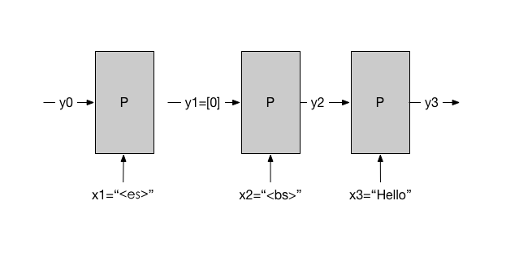

# 大规模 RNNLM

## 背景

### RNNLM v.s. n-gram LM

1. RNNLM和n-gram LM比较，RNNLM几乎总是能得到更精准的模型（更小的perplexity）<sup>[miklov](#miklov)</sup>。
1. 用越大的语料训练n-gram LM，得到的模型越精确<sup>[glm](#glm)</sup>。

### LM对应用的影响

1. 随着 perplexity的降低，LM对语音识别的帮助更明显<sup>[gasr](#gasr)</sup>。
1. 随着 perplexity的减低，LM对翻译的帮助更明显<sup>[gmt](#gmt)</sup>。

### LM的训练规模

1. 训练 n-gram LM 可以方便地并行化，所以支持很大的训练语料。百度用100T tokens训练。
1. 训练 RNNLM 很不容易。目前最大规模是Google的工作<sup>[glm](#glm)</sup>。其他工作的规模比Google小得多。具体见下表：


     |指标  |Google             | 学校       |
	 |-----|-------------------|-----------|
	 | 语料 |1G tokens          |50M tokens |
	 | 字典 |800K words         |60K words  |
	 | 规模 |32 Tesla K40 GPUs  |1~2 GPUs   |
	 | 时间 |5 to 10 days       |weeks      |


## 挑战

**用大到 1T tokens 的语料训练一个 RNNLM，并且比较其与对应规模的 n-gram
  LM 的perplexity。**

这个挑战是检验计算能力的一个机会。要实现它，技术上至少有有两个难点：

1. 规模：如果要用超过32个GPU，sync SGD可能就不合适了，因为sync SGD算法
   不适合错误恢复等支持大规模分布式任务的基本性质。

1. 算法：但是没有人验证过async SGD算法学RNNLM是否收敛。


在能够应对这两个难点之前，需要先了解目前的做法：

## 数据布局

训练数据是以“文档”的形式存在的。每篇文档是一个“词”的序列。训练数据准备
是指在尽量少（或者不）打破词的顺序的情况下，把文档排列成可以并行计算的
mini-batches。

目前一个被验证在 sync SGD 学习的情况下有效的方式是：

1. GPU数量记为N，每个mini-batch里的词序列数量记为M。
1. 把所有文档连成一串，总 token 数量记为 T。
1. 把这一串均匀切分成 B = N x M 个长子串。每个子串长度大约是 A = T/S。
1. 将这些长子串排列成一个 B x A 的矩阵 X。
1. 限定每个 mini-batch 里的每个序列长度都是 S（通常是30），
1. 每个 mini-batch 是 X 中的一个 B x S 的子矩阵 按行分成 N 份。

考虑一个 B x S 大小的窗口，从 X 的左边向右滑动，每次移动 S 个词。每次
移动后的窗口里的子矩阵就是N个GPU上的mini-batches。

这种分发的道理，在下一节里可以看出来。

举一个例子：

比如我们有以下几个训练文档：

1. `I have a cup.`
1. `You have a cup.`
1. `My cup is red.`
1. `Your cup is blue`

串成一串之后一共 T=24 个词：

```
<bs> I have a cup <es> <bs> You have a cup <es> <bs> My cup is red <es> <bs> Your cup is blue <es>
```

假设我们有 N=2 个GPU，每个mini-batch 里有 M=2 个序列，那么我们应该把上
面数据折叠成 B = N x M = 4 段，每段 A = T/S = 6 个词：

```
  minibatch 1       minibatch 2
---------------------------------
| <bs> I    have | a  cup  <es> |  on GPU 1
| <bs> You  have | a  cup  <es> |
---------------------------------
| <bs> My   cup  | is red  <es> |  on GPU 2
| <bs> Your cup  | is blue <es> |
---------------------------------
```

## 训练过程

上图的数据布局和训练过程的关系如下：

1. 第一个minibatch：
   1. GPU 1 用田字格左上部分更新局部模型，同时 GPU 2用田字格左下部分更新局部模型，随后
   1. 两个GPU集思广益，然后开始下一个minibatch
1. 第二个minibatch：
   1. GPU 1 用右上部分，同时 GPU 2 用右下部分。
   1. 两个GPU集思广益，然后开始下一个minibatch

其中，每个GPU在每个minibatch里的训练工作可以用下图表示：


针对每一个训练数据串，训练的优化目标是：y1和x2接近，同时y2和x3接近，以此类推。

这个例子里，最初的“记忆”y1是一个全零的向量；而最后的y3将会在 GPU 1 在
下一个minibatch里处理 `a cup <es>`的时候作为 y1。这就要求每个 GPU 记住
每个序列的最后的“记忆”，以便在下一个minibatch里初始化记忆。

类似的一个问题是：当`<bs>`出现在一个序列里的时候，GPU 要记得重置记忆。
比如下面例子里，因为序列中间出现了一个x2=`<bs>`，我们需要把y1设置为0，
表示此前没有记忆。



## 学习步长的设置

在用sync SGD训练RNNLM的尝试中，一个要点是：如果发现若干iterations之后
模型的validation dataset perplexity变化很小了，则把学习步长（learning
rate）减小一半。为什么这样可行，请大家想想，画一个示意图出来。

## One-hot Vector Times Matrix

训练RNNLM的时候，每个frame的输入是一个维度和词表大小一样的稀疏向量，其
中只有一个元素是1（表示一个词），其他元素都是0。这样的向量和RNN的第一
级matrix相乘的时候，计算可以简化为选择matrix中对应的一行。这个技巧可以
极大地节省计算时间。实际上，有些DNN frameworks之所以不能支持RNNLM的试
验，就是因为没有对 one-hot vector的加速计算的支持。

## References

- <a name=glm>glm</a> https://arxiv.org/abs/1602.02410
- <a name=miklov>miklov</a> http://www.fit.vutbr.cz/~imikolov/rnnlm/thesis.pdf
- <a name=gasr>gasr</a> https://research.googleblog.com/2012/10/large-scale-language-modeling-in.html
- <a name=gmt>gmt</a> http://www.aclweb.org/anthology/D07-1090.pdf
