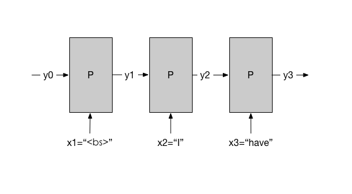

# 大规模 RNNLM

## 背景和挑战

文献中训练 RNNLM 的最大语料接近 1G tokens。此时 RNNLM 相对 n-gram LM
能得到更低的 perplexity（更高的精度）。这样的高精度，在翻译领域具有很
重要的价值。在语音识别领域，RNNLM 虽然因为解码速度慢，不能被用于
end-to-end speech 的解码，但是可以在解码之后用于 ranking candidate
transcriptions，从而达到更好的识别精确度。

目前一个重要的挑战是：n-gram LM 因为训练算法适合大规模并行化，所以可以
用包含 1T tokens 的大语料来训练。但是 RNNLM 的训练规模的提升很困难。而
使用更多训练预料是降低 perplexity 的重要有效方法。所以目前一个很能体现
计算能力的研究是：

**用 1T tokens 训练一个 RNNLM，并且比较其与对应的 n-gram LM 的
  perplexity。**

这个挑战是检验计算能力的一个机会。要实现它，技术上至少有有两个难点：

1. 目前在小语料情况下，大家都是用 sync SGD 算法训练 RNNLM 模型。但是在
   大语料情况下， sync SGD 不能 scalable（详见附录）。用 Google
   Tensorflow 我们可以描述一个 async SGD 算法来训练 RNNLM，但我们并不
   确定 async SGD 是否能收敛。

1. 很大规模的 Tensorflow job 如果没有 Kubernetes 调度，实验进度会很慢。
   但是 Kubernetes 为了方便机群管理引入的 SDN（software defined
   network）会带来额外的网络开销。我们要想办法控制网络传输数据总量，以
   保障 job 执行效率。


在能够应对这两个难点之前，需要先了解目前的做法：

## Training Data Preparation

训练数据是以“文档”的形式存在的。每篇文档是一个“词”的序列。训练数据准备
是指在尽量少（或者不）打破词的顺序的情况下，把文档排列成可以并行计算的
mini-batches。

目前一个被验证在 sync SGD 学习的情况下有效的方式是：

1. GPU数量记为N，每个mini-batch里的词序列数量记为M。
1. 把所有文档连成一串，总 token 数量记为 T。
1. 把这一串均匀切分成 B = N x M 个长子串。每个子串长度大约是 A = T/S。
1. 将这些长子串排列成一个 B x A 的矩阵 X。
1. 限定每个 mini-batch 里的每个序列长度都是 S（通常是30），
1. 每个 mini-batch 是 X 中的一个 B x S 的子矩阵 按行分成 N 份。

考虑一个 B x S 大小的窗口，从 X 的左边向右滑动，每次移动 S 个词。每次
移动后的窗口里的子矩阵就是N个GPU上的mini-batches。

这种分发的道理，在下一节里可以看出来。

举一个例子：

比如我们有以下几个训练文档：

1. `I have a cup.`
1. `You have a cup.`
1. `My cup is red.`
1. `Your cup is blue`

串成一串之后成为

```
<bs> I have a cup <es> <bs> You have a cup <es> <bs> My cup is red <es> <bs> Your cup is blue <es>
```

一共 T=24 个词。

假设我们有 N=2 个GPU，每个mini-batch 里有 M=2 个序列，那么我们应该把上
面数据折叠成 B = N x M = 4 段，每段 A = T/S = 6 个词：

```
  minibatch 1       minibatch 2
---------------------------------
| <bs> I    have | a  cup  <es> |  on GPU 1
| <bs> You  have | a  cup  <es> |
---------------------------------
| <bs> My   cup  | is red  <es> |  on GPU 2
| <bs> Your cup  | is blue <es> |
---------------------------------
```

训练过程

1. 第一个minibatch：
   1. GPU 1 用田字格左上部分更新局部模型，同时 GPU 2用田字格左下部分更新局部模型，随后
   1. 两个GPU集思广益，然后开始下一个minibatch
1. 第二个minibatch：
   1. GPU 1 用右上部分，同时 GPU 2 用右下部分。
   1. 两个GPU集思广益，然后开始下一个minibatch

## Reset Memory at Document Boundary

RNN的训练过程可以用下图表示：



针对每一个训练数据串，我们希望y1和x2接近，同时y2和x3接近，以此类推。

这个例子里，最初的“记忆”y1是一个全零的向量；而最后的y3将会在 GPU 1 在下一个minibatch里处理 `a cup <es>`的时候作为 y1。这就要求每个 GPU 记住每个序列的最后的“记忆”，以便在下一个minibatch里初始化记忆。

类似的一个问题是：当`<bs>`出现在一个序列里的时候，GPU 要记得重置记忆。比如下面例子：


因为序列中间出现了一个x2=`<bs>`，我们需要把y1设置为0，表示此前没有记忆。

## Learning Rate Cut-off

## One-hot Vector Times Matrix
